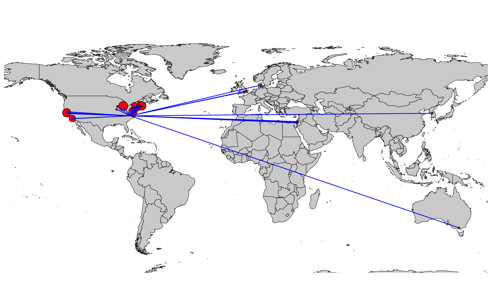
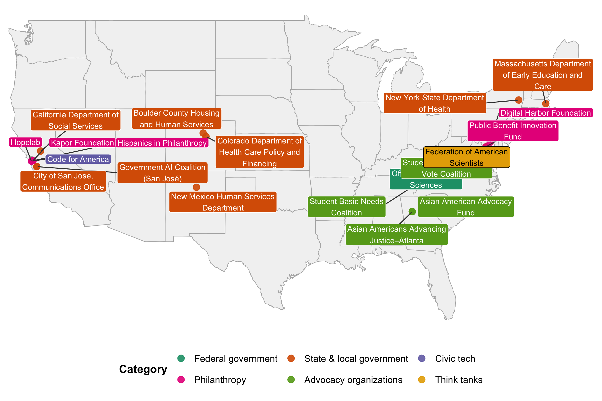
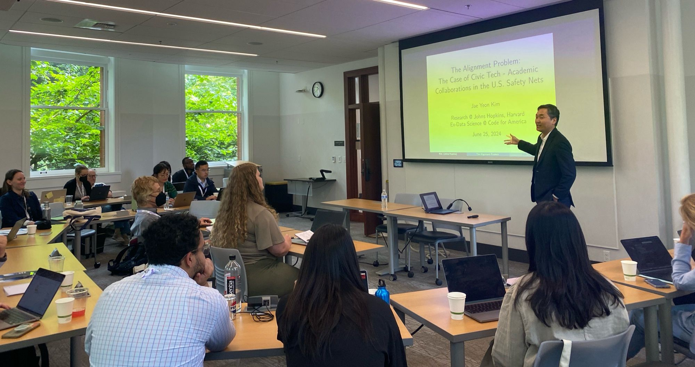
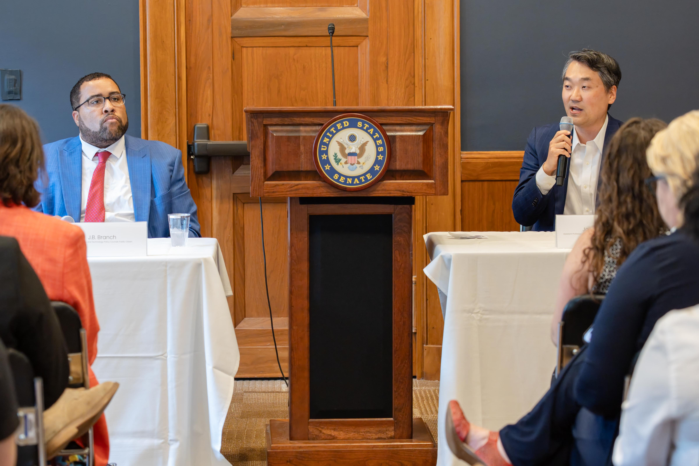

> [My version of policy entrepreneurship is closer to the role of a facilitator. I aspire to be someone who helps create space for collective learning and problem-solving.](https://substack.com/home/post/p-198463690)

#### Bridging Research and Practice

- **Co-founder**, [*Data for Good Roundtables*](https://sites.google.com/view/d4g-roundtables?usp=sharing) (2025– )  
  A safe and brave space where academics and practitioners come together to discuss using data for good.

#### Collaborators, Project Partners, and Lab Affiliations

##### Collaborator Locations

{fig-align="center" width="100%"}

##### Applied Project Partners

{fig-align="center" width="100%"}

I maintain an active network of [collaborators](coauthors.qmd) and [project partner organizations](partners.md), and work closely with several research labs across institutions:

- **Better Government Lab**, Georgetown McCourt & Michigan Ford School  
  (Co-directors: Donald Moynihan, Pamela Herd, Sebastian Jilke) 
- **Algorithms, Data, and Public Policy Technology (ADAPPT) Lab**, New York University
  (Director: Alex Chohlas-Wood)
- **P3 Lab**, Johns Hopkins SNF Agora Institute  
  (Director: Hahrie Han)  
- **Civic Power Lab**, Harvard Kennedy School  
  (Director: Liz McKenna)  
- **REPS Lab**, UCLA  
  (Director: Efrén Pérez)

#### Field-Building in Computational Social Science

- **Advisory Council Member**, [Summer Institute in Computational Social Science (SICSS)](https://sicss.io/people)  
- **Co-organizer**, [SICSS Bay Area (2020)](https://sicss.io/2020/bay_area/)  
  Co-hosted by UC Berkeley and Stanford  
- **Co-organizer**, [SICSS Korea (2022)](https://sicss.io/2022/korea/)  
  Co-hosted by KAIST and KDI School  

#### Community Engagement & Mentorship

- **Speaker / Panelist on Civic Tech**  
  *MPP Social, University of North Carolina at Chapel Hill, 2026*  
  *Public Management Research Conference (PMRC), University of Washington, 2024*

- **Panelist on Data Science Career Paths**  
  *Stanford University, 2024*  
  *UC Berkeley, 2023*  
  *[International Conference on Computational Social Science (IC2S2)](https://ic2s2.org/), 2024*

{fig-align="center" width="60%"}

{fig-align="center" width="60%"}