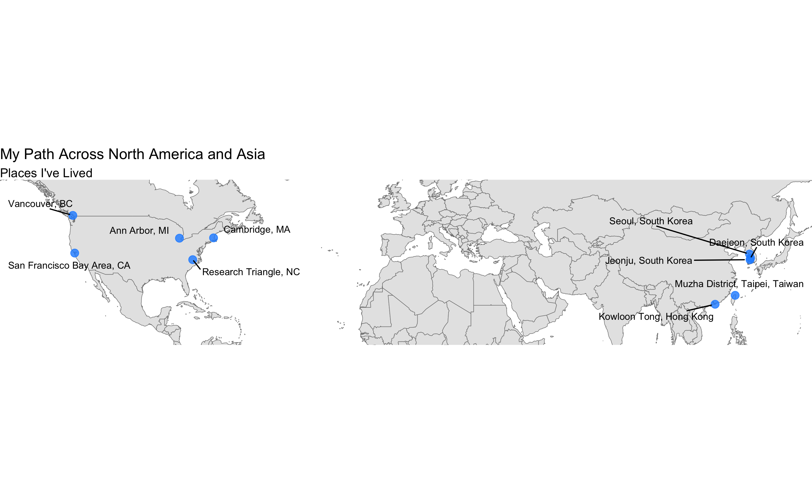
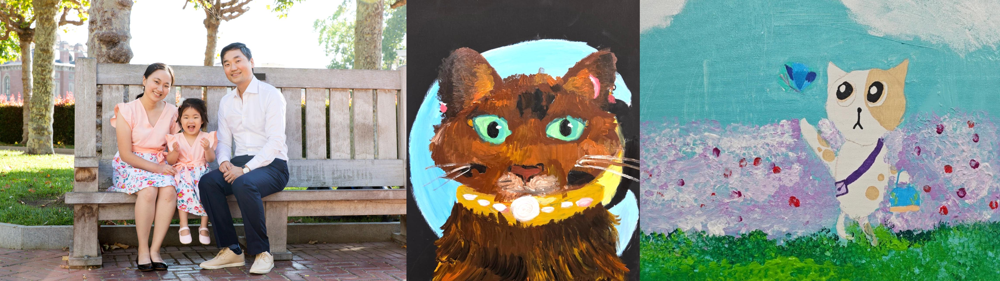

{width=800px}

So far, I’ve lived in more than ten cities across five countries on two continents. I was born and raised in South Korea (Jeonju, Daejeon, Seoul, Changwon, and Dongducheon) and have also lived in Hong Kong (Kowloon Tong), Taiwan (Muzha District, Taipei City), Canada (Vancouver), and across the United States, including the San Francisco Bay Area (CA), Ann Arbor (MI), Cambridge (MA), and the Research Triangle (NC). My path has been non-linear, spanning academia, industry, public service, and civic technology. These experiences have shaped my identity as a bridge builder and translator, someone who works across boundaries of scholarship and practice, discipline and sector, and place and community. 

At the same time, my perspective and career path have been shaped by where I began. I’m a first-generation college student from a working-class family. 

These experiences continue to guide the research questions I pursue and the problems I choose to engage with.

On a personal note, I used to practice martial arts ([Taekwondo](https://en.wikipedia.org/wiki/Taekwondo), [Wushu](https://en.wikipedia.org/wiki/Wushu_(sport)), and [Kendo](https://en.wikipedia.org/wiki/Kendo)), but I now focus on distance running and hiking. I believe we can learn a great deal about ourselves by voluntarily pushing our limits. My appreciation for endurance may stem from my religious upbringing. One thing I share with John Legend and Trevor Noah is that we all grew up in households where attending multiple services on Sundays was normal.

Below is a collection of essays I’ve written over the years, organized into three categories: professional reflections, personal reflections, and career advice. You can also find my writing on [Substack](https://jaeyeonkim.substack.com/).

**Professional Reflections**

- [*I Didn’t Think I’d Return to Academia Until I Saw What Was Missing*](return2academia.html)

- [*Researching and Doing Policy Science as a Political Scientist*](policy_science.html)

**Personal Reflections**

- [*Paths Denied, Paths Created*](memorial_day.html)

- [*Digging the Well: What I Learned from Haruki Murakami’s Everyday Discipline*](haruki.html)

**Career Advice**

- [*Academic Job Talks as Storytelling: Why Character Matters as Much as Plot*](academic_job_talk.html)

- [*What I Wish I Knew Before the Academic Job Market*](job_market.html)

**Korean essays**

- [*한국인 대학원생들을 위한 미국 아카데믹 커리어 조언* 웹사이트](https://jaeyk.github.io/us_ac_career_for_korean_students/)

<figure style="text-align: center;">
  
  <figcaption>I am married to Sunmin Yun, a semiconductor (chip) engineer, and we have one daughter, Jane. The photo was taken on the day I received my Ph.D. from Berkeley, and the two images on the right are Jane’s paintings.</figcaption>
</figure>
