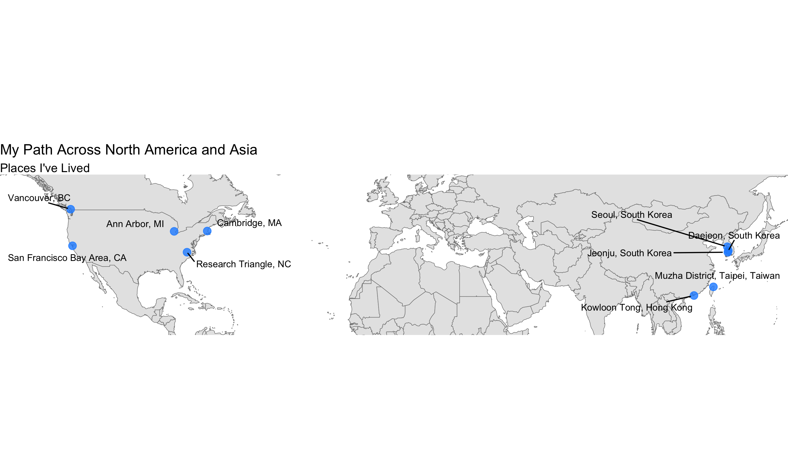
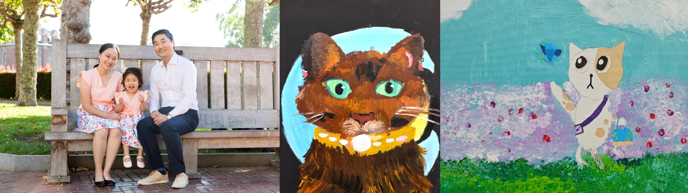

{width=800px}

So far, I have lived in more than ten cities across five countries on two continents: South Korea (Jeonju, Daejeon, Seoul, Changwon, and Dongducheon); Hong Kong (Kowloon Tong); Taiwan (Taipei’s Muzha District); Canada (Vancouver); and the United States (the San Francisco Bay Area, California; Ann Arbor, Michigan; Cambridge, Massachusetts; and the Research Triangle, North Carolina). When I was young, I grew up in a semi-rural community where almost everyone knew one another. Later in life, I have also lived in some of the world’s largest cities.

Like my upbringing, my career path has been shaped by a wide range of experiences and influences. I spent years working in the tech industry and the digital activism community. Before graduate school, I worked as a strategy manager at a software startup. While in college, I served as the youngest member of the user services advisory board at Naver, South Korea’s largest internet company, often called the Korean Google. I was an active member of the Korean branch of Creative Commons and Global Voices, wrote regular op-eds on tech and society for local newspapers and magazines, and published several books on the subject. I helped my alma mater, Korea University, launch South Korea’s first OpenCourseWare website, following the MIT OpenCourseWare model, while completing two study-abroad programs in Hong Kong and Taiwan. I gained experience as a street-level bureaucrat as well. As an alternative to mandatory military service, I served in the district office of one of the most economically distressed areas within the Seoul Metropolitan Government. For two years, I helped classify and triage citizen service requests concerning issues ranging from potholes to housing, similar to those handled through 311 systems in the United States.

After moving to the United States in 2014, I earned an M.A. and a Ph.D. in political science from UC Berkeley. I also studied computational social science and political economy. Berkeley now offers designated emphases in both fields, but those options were unavailable at the time. While still a graduate student, I taught a graduate-level course on computational methods as the instructor of record several times. Before completing my doctoral program, I became a predoctoral fellow at the SNF Agora Institute at Johns Hopkins University, where I remained affiliated for five years. Soon after graduating from the Ph.D. program, I went back to Korea and taught for a year at the KDI School of Public Policy and Management, South Korea’s premier public policy school. At KDI, I helped develop the country’s first policy-focused data science program. I also published a Korean-language book on using data for the common good. The book was positively reviewed by major newspapers across the ideological spectrum, selected by the Korean government as a recommended book in the social sciences, and distributed to public libraries nationwide. I then returned to the United States and worked as a data scientist at Code for America, a leading civic tech organization. In that role, I worked with federal, state, and local governments. After about two years of the public service, I left Code for America and returned to academia as a policy scholar and data scientist trained in political science.

My path has been anything but linear. I have built a career spanning industry, public service, and academia because I have pursued not a particular role, but a path that allows me to make *the greatest positive societal impact with the talents I have been given*. These experiences have made me who I am today, a bridge builder and translator who works across the boundaries between scholarship and practice, disciplines and sectors, and places and communities.

At the same time, my perspective and career path have been shaped by where I began. I’m a first-generation college student from a working-class family. These formative experiences guide the research questions I pursue and the problems I choose to engage with.

On a personal note, I used to practice martial arts ([Taekwondo](https://en.wikipedia.org/wiki/Taekwondo), [Wushu](https://en.wikipedia.org/wiki/Wushu_(sport)), and [Kendo](https://en.wikipedia.org/wiki/Kendo)), but I now focus on distance running. I have finished three half marathons so far (San Francisco [2x], Berkeley), and am training for a full marathon in March 2027 (Napa Valley). I believe we can learn a great deal about ourselves by voluntarily pushing our limits. My appreciation for endurance may stem from my religious upbringing. In Greek, the language of the New Testament, the words for endurance and patience are the same (*hypomonē*). One thing I share with John Legend, a musician, and Trevor Noah, a stand-up comedian, is that we all grew up in households where attending multiple services on Sundays was normal.

Below is a collection of essays I’ve written over the years, organized into three categories: professional reflections, personal reflections, and career advice. You can also find my writing on [Substack](https://jaeyeonkim.substack.com/).

**Professional Reflections**

- [*I Didn’t Think I’d Return to Academia Until I Saw What Was Missing*](return2academia.html)

- [*Researching and Doing Policy Science as a Political Scientist*](policy_science.html)

**Personal Reflections**

- [*Paths Denied, Paths Created*](memorial_day.html)

- [*Digging the Well: What I Learned from Haruki Murakami’s Everyday Discipline*](haruki.html)

**Career Advice**

- [*Advice for Prospective PhD Students*](contacting_potential_advisors.html)

- [*How to Write a Statement of Purpose for Graduate School in Political Science / Public Policy*](sop.html)

- [*Academic Job Talks as Storytelling: Why Character Matters as Much as Plot*](academic_job_talk.html)

- [*What I Wish I Knew Before the Academic Job Market*](job_market.html)

**Korean essays**

- [*한국인 대학원생들을 위한 미국 아카데믹 커리어 조언* 웹사이트](https://jaeyk.github.io/us_ac_career_for_korean_students/)
- [*대학사용법 개정판* 서브스택](https://learn2career.substack.com/) [[*자매판 팟캐스트*](https://learn2career.substack.com/podcast)]

<figure style="text-align: center;">
  
  <figcaption>I am married to Sunmin Yun, a semiconductor (chip) engineer, and we have one daughter, Jane. The photo was taken on the day I graduated from Berkeley with a Ph.D. in Political Science, and the two images on the right are Jane’s paintings. Sunmin and I do not paint, but we do love painting (and arts in general), to the extent that we chose our honeymoon destinations based on the museums we wanted to visit.</figcaption>
</figure>
