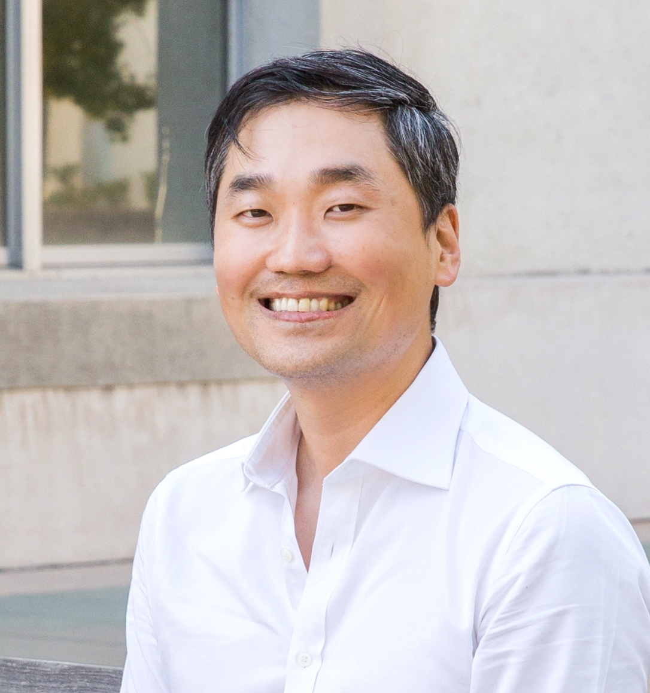

Hello! I am an Assistant Professor at the KDI School of Public Policy and Management. I teach computational social science and civic data science and co-direct the school's data science concentration program. I am also affiliated with the SNF Agora Institute at Johns Hopkins University, where I was a pre- and postdoctoral fellow. Since 2020, I have been working on the [Mapping Modern Agora project](https://snfagora.jhu.edu/project/mapping-the-modern-agora/) (incubated at the SNF Agora) that utilizes big data and machine learning to map the U.S. civil society at scale. I received my Ph.D. in political science from UC Berkeley, where I was a Senior Data Science Fellow at D-Lab.

## Research agenda 

I study power, inequality, and political change drawing on computational, experimental, and archival methods. My research examines how policy design and communication shape social hierarchies and how disadvantaged groups resist the unequal system through organizing. I am also interested in refining measures of identity and marginalization, investigating online harms (hate speech, misinformation, privacy, and fairness violation), and using data to strengthen civic engagement and democracy. My regional focus is the US, Canada, and East Asia.

## Research pipeline

My work has been published in or forthcoming at political science (e.g., *Perspectives on Politics* [2x], *Political Research Quarterly*, *Studies in American Political Development*, The *ANNALS*, and *PS: Political Science and Politics*) and computational social science journals and proceedings (e.g., *Journal of Online Trust and Safety*, *Information Systems Frontiers*, *Journal of Computational Social Science*, and *ICWSM*). My research has also appeared in popular outlets such as the *Washington Post's Monkey Cage* and *FiveThirtyEight*. 

I have two ongoing book projects. First, I am currently preparing the book version of [my award-winning dissertation](https://www.proquest.com/docview/2572633754?pq-origsite=gscholar&fromopenview=true), tentatively titled "From Demography to Destiny: How Racial Groups Emerged in the United States." Second, I am also working on a primer on civic data science (in Korean). This book is forthcoming by Sejong Books in 2023.

## Awards 

- *Best Dissertation Award*, Section on Urban and Local Politics, American Political Science Association (2022)
- *Don T. Nakanishi Award for Distinguished Scholarship and Service in Asian Pacific American Politics*, Western Political Science Association (2020)

## Publications 

### Peer-reviewed journal articles

Equal contributions = +

9. ["Civil Society, Realized: Equipping the Mass Public to Express Choice and Negotiate Power."](https://journals.sagepub.com/doi/full/10.1177/00027162221077471) (Hahrie Han+
and Jae Yeon Kim+) *ANNALS of the American Academy of Political and Social Science*, Online First in March 2022

8. ["Teaching Computational Social Science for All."](https://www.cambridge.org/core/journals/ps-political-science-and-politics/article/abs/teaching-computational-social-science-for-all/66EAB886BCF21C647E2387051D6A9BEF) (Jae Yeon Kim and Margaret Ng) *PS: Political Science & Politics*, Online First in February 2022

7. ["Identity and Status: When Counterspeech Increases Hate Speech Reporting and Why."](https://link.springer.com/article/10.1007/s10796-021-10229-2) (Jae Yeon Kim, Jaeung Sim, and Daegon Cho) *Information Systems Frontiers*, Online First in January 2022 [replication](https://github.com/jaeyk/status_identity_hate_speech_reporting)

6. ["COVID-19 and Asian Americans: How Elite Messaging and Social Exclusion Shape Partisan Attitudes."](https://t.co/4Axd0gEQns) (Nathan Chan, Jae Yeon Kim, and Vivien Leung) *Perspectives on Politics*, Online First in December 2021 [replication](https://github.com/jaeyk/covid19antiasian/)

5. ["Rewiring Linked Fate: Bringing Back History, Agency, and Power."](https://www.cambridge.org/core/journals/perspectives-on-politics/article/rewiring-linked-fate-bringing-back-history-agency-and-power/CF08421CA51138DF922AB05F056E80B7) (Reuel Rogers+ and Jae Yeon Kim+) *Perspectives on Politics*, Online First in December 2021 [replication](https://github.com/jaeyk/linked_fate_review/)

4. ["Misinformation and Hate Speech: The Case of Anti-Asian Hate Speech During the COVID-19 Pandemic."](https://tsjournal.org/index.php/jots/article/view/13/5) (Jae Yeon Kim+ and Aniket Kesari+) *Journal of Online Trust and Safety*, 2021, 1(1) [replication](https://github.com/jaeyk/asian_hate_misinformation)

3. ["Integrating Human and Machine Coding to Measure Political Issues in Ethnic Newspaper Articles."](https://link.springer.com/article/10.1007/s42001-020-00097-2) (Jae Yeon Kim), *Journal of Computational Social Science*, 2021, 4(2), 585-612 [replication](https://github.com/jaeyk/content-analysis-for-evaluating-ML-performances) (Winner of the **2020 Western Political Science Association Don T. Nakanishi Award**)

2. ["How Other Minorities Gained Access: The War on Poverty and Asian American and Latino Community Organizing."](https://journals.sagepub.com/doi/10.1177/1065912920983456) (Jae Yeon Kim), *Political Research Quarterly*, Online First in December 2020 [replication](https://github.com/jaeyk/regression-analysis-with-time-series-data)

1. ["Racism Is Not Enough: Minority Coalition Building in San Francisco, Seattle, and Vancouver."](https://www.cambridge.org/core/journals/studies-in-american-political-development/article/racism-is-not-enough-minority-coalition-building-in-san-francisco-seattle-and-vancouver/7557642023E744D2E0FA68D800C8E08E) (Jae Yeon Kim), *Studies in American Political Development*, 2020, 34(2), 195-215 [replication](https://github.com/jaeyk/analyzing-archival-data)

### Peer-reviewed conference and workshop proceedings

1. ["Intersectional Bias in Hate Speech and Abusive Language Datasets."](https://arxiv.org/abs/2005.05921) (Jae Yeon Kim, Carlos Ortiz, Sarah Nam, Sarah Santiago, and Vivek Datta), 2020, [*Proceedings of the Fourteenth International AAAI Conference on Web and Social Media (ICWSM), Data Challenge Workshop*](https://sites.google.com/view/icwsm2020datachallenge/home) [replication](https://github.com/jaeyk/intersectional-bias-in-ml)

### Book projects 

- "From Demography to Destiny: How Racial Groups Emerged in the United States." (based on [dissertation](https://escholarship.org/content/qt3531f8fr/qt3531f8fr.pdf))
- "Civic Data Science: Using Data to Mature Democracy." (in Korean; forthcoming by *Sejong Books* in 2023)

### Edited volume book chapters

1. ["Machines Do Not Decide Hate Speech: Machine Learning, Power, and the Intersectional Approach."](https://osf.io/preprints/socarxiv/chvgp/) (Jae Yeon Kim) Forthcoming at *Challenges and Perspectives of Hate Speech Analysis* ([Digital Communication Research open-access book series]((https://www.digitalcommunicationresearch.de/)) by the German Communication Association)

### Research briefs

1. ["Thanks to Trump's Rhetoric, Asian Americans Are Moving Toward the Democratic Party."](https://www.washingtonpost.com/politics/2021/03/30/thanks-trumps-rhetoric-asian-americans-are-moving-toward-democratic-party/?utm_campaign=wp_monkeycage&utm_medium=social&utm_source=twitter&tid=sm_tw_monkeycage) (Nathan Chan, Jae Yeon Kim, and Vivien Leung), *Washington Post's Monkey Cage*, March 30, 2021

2. ["The Three Tales of Chinatown: Why Racism Is Not Enough to Create a Race-based Coalition among Marginalized Groups."](https://canada.berkeley.edu/three-tales-chinatown-why-racism-not-enough-create-race-based-coalition-among-marginalized-groups) (Jae Yeon Kim), *UC Berkeley Canadian Studies Program*, March 29, 2021

### Public writing

1. ["Good Troublemakers Are the Key to Fixing Democracy in South Korea"](https://www.nknews.org/pro/good-troublemakers-are-the-key-to-fixing-democracy-in-south-korea/?t=1660440015387) (Jae Yeon Kim), *Korea Pro*, May 16, 2022.

1. ["Why Teaching Social Scientists How To Code Like A Professional Is Important."](https://dlab.berkeley.edu/news/why-teaching-social-scientists-how-code-professional-important) (Jae Yeon Kim), *UC Berkeley D-Lab*, September 23, 2020

2. ["BAY-SICSS: Bridging Computational Social Scientists and Practitioners for Social Good."](https://bids.berkeley.edu/news/bay-sicss-bridging-computational-social-scientists-and-practitioners-social-good) (Jaren Haber, Jae Yeon Kim, and Nick Camp), *Berkeley Institute of Data Science*, September 15, 2020

3. ["Five Principles to Get Undergraduates Involved in Real-world Data Science Projects."](https://ocean.sagepub.com/blog/skills/5-principles-to-get-undergraduates-involved-in-real-world-data-science-projects) (Jae Yeon Kim), *SAGE Ocean*, June 24, 2020

4. ["How I Accidentally Became Interested in Data Science."](https://dlab.berkeley.edu/news/how-i-accidentally-became-interested-data-science) (Jae Yeon Kim), *UC Berkeley D-Lab*, February 24, 2020

## Software development 

I have developed open-source software that supports data curation.

1. [MapAgora](https://snfagora.github.io/MapAgora/): R package for getting tax reports, websites, and social media handles related to nonprofit organizations in the United States (with Milan de Vries)

2. [tidytweetjson](https://jaeyk.github.io/tidytweetjson/): R package for turning Tweet JSON files into a cleaned and wrangled dataset

3. [tidyethnicnews](https://jaeyk.github.io/tidyethnicnews/): R package for turning search results from the largest database on ethnic newspapers published in the United States ("Ethnic NewsWatch") into a cleaned and wrangled dataset

## Public datasets

1. [Linked Fate Literature Review Dataset (1999-2019)](https://dataverse.harvard.edu/file.xhtml?fileId=5194002&version=1.0)

2. [Asian American and Latino Advocacy and Community Service Organizations Dataset (1868-2016)](https://doi.org/10.7910/DVN/FLUPBJ)

## Teaching and advising 

I am an award-winning instructor and have taught computational social science in semester-long courses and short workshops. I have co-authored articles on [making computational methods accessible to social scientists](https://www.cambridge.org/core/journals/ps-political-science-and-politics/article/abs/teaching-computational-social-science-for-all/66EAB886BCF21C647E2387051D6A9BEF) and advising social science students on data science careers. I wrote an open-access textbook for computational methods titled ["Computational Thinking for Social Scientists."](https://jaeyk.github.io/comp_thinking_social_science/) 

### Open-access textbook

* [Computational Thinking for Social Scientists](https://jaeyk.github.io/comp_thinking_social_science/): The open-access textbook covers UNIX command-line tools, version control (Git/GitHub), data wrangling, visualization, functional programming, data product development (Shiny & R package), digital data collection (webscraping & API), machine learning (tidymodels framework), and SQL.

## Community building 

I love learning from other people who share similar research interests and building interdisciplinary communities. I have developed a large and growing network of [collaborators](https://raw.githubusercontent.com/jaeyk/jaeyk.github.io/gh-pages/coauthors.png) across social sciences and engineering. 

### Summer Institute in Computational Social Science 

I have been an active member of the [the Summer Institute in Computational Social Science](https://sicss.io/) (SICSS).

- In 2019, I participated in the SICSS' Princeton main location.
- In 2020, I co-organized [the first San Francisco Bay Area partner location](https://sicss.io/2020/bay_area/), with a theme of computational social science for social good. This event was co-hosted by UC Berkeley and Stanford.
- In 2021, I served as an R bootcamp instructor for [the first Howard-Mathematica partner location](https://sicss.io/2021/howard-mathematica/) (the first SICSS event held at a Historically Black College and University).
- In 2022, I co-organized [the first South Korean partner locatoin](https://sicss.io/2022/korea/). This event was co-hosted by KAIST and KDI School.

### KDIS Frontiers in Data and Policy Seminar Series

I will launch the KDIS Frontiers in Data and Policy Seminar Series in Fall 2022. Fellow junior scholars in applied/quantitative/computational social science (broadly construed), if you want to present your research to policy-makers from Korea and elsewhere, please sign up using [this form](https://forms.gle/BC5MTG9jgAYsBzoG9) (as of July 21, 2022, 26 researchers signed up). 

## Contact

* Email: [jaeyeonkim@kdis.ac.kr](mailto:jaeyeonkim@kdis.ac.kr)

* Office: S320 (Office Hours: Friday 14:00-16:00, Please make an appointment via [Calendly](https://calendly.com/jkim-46))

## Personal

A summary of who I am. I was born and raised in South Korea, but I lived in Hong Kong and Taiwan by the time I finished college. While in college, I helped my alma mater launch its first Open Education Resource project (KU OCW), wrote tech columns for Korean newspapers and magazines, and served on the user service advisory board of Naver---the largest Internet company in S. Korea. Upon graduation, I worked as a strategy manager at a software startup. I also was an activist for the Korean branch of Creative Commons (a digital rights advocacy organization; renamed C.O.D.E.) and published a [book](http://www.yes24.com/Product/Goods/13765542) on how to get the best out of college, which sold more than 10,000 copies. I moved to the San Francisco Bay Area in 2014 for my graduate study and happily merged my four sides: an academic, a nerd, an entrepreneur, and an activist. When I don't write and code, I listen to music and enjoy distance running (10k and a half marathon), drawing, and cooking. I ran [my first half marathon](https://www.runraceresults.com/Secure/RaceResults.cfm?ID=RCLF2021) in 2021 (The San Francisco Marathon; Finish: 2:03:26) and am currently practicing for a full marathon. I used to be a Berkeley Taekwondo and Wushu club member and am a still fan of many martial arts.