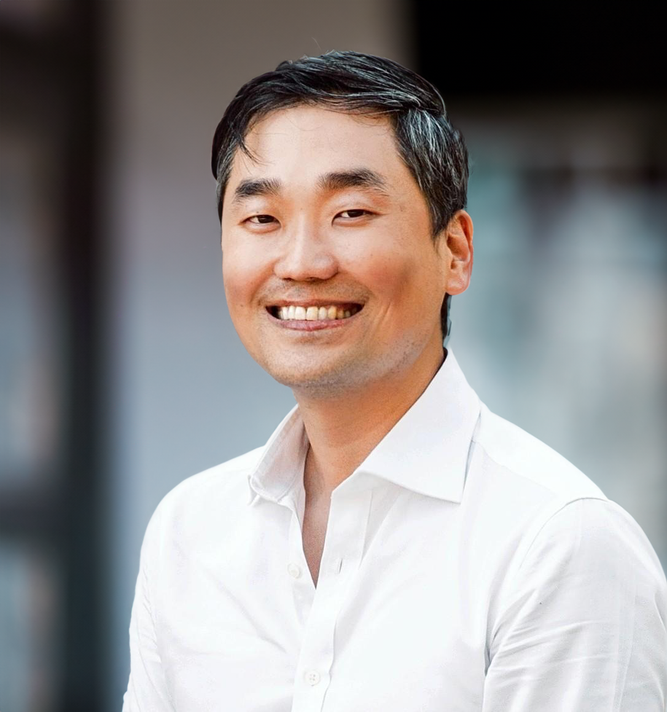

  
Hello! I am a senior data scientist at [the Safety Net Innovations Lab](https://codeforamerica.org/programs/social-safety-net/) at [Code for America](https://codeforamerica.org/people/jae-yeon-kim/), and a research fellow at  [the SNF Agora Institute](https://snfagora.jhu.edu/person/jae-yeon-kim/) and [P3 Lab](https://www.p3researchlab.org/our_team) at Johns Hopkins University, as well as the Center for Public Leadership and [Civic Power Lab](https://cities.harvard.edu/initiatives/civic-power-lab/) at Harvard Kennedy School. 
I hold a Ph.D. in political science from UC Berkeley. Since 2020, I have co-developed [the Mapping Modern Agora project](https://snfagora.jhu.edu/project/mapping-the-modern-agora/), which utilizes big data and machine learning to map the U.S. civil society at scale. 

### Travel & Talks (2024)

* January 11, Data Science Seminar, University of Washington. Invited speaker. 
* February 15, Race, Ethnicity, Politics, & Society (REPS) Lab, UCLA. Invited speaker.
* February 16, Politics of Race, Immigration, and Ethnicity Consortium (PRIEC), Claremont Graduate University & UC Riverside.
* March 14, Data Science Across Industries Panel, PhD Pathways Event, Stanford. Invited speaker.
* March 26, Government Department Seminar, Wesleyan University. Invited speaker.
* March 28-30, Western Political Science Association (WPSA) annual meeting, Vancouver.
* April 23, P3 Lab Seminar, Johns Hopkins. Invited speaker.
* June 11-12, Summer Institute in Migration Research Methods, UC Berkeley. Invited speaker. 
* June 26-29, Public Management Research Conference (PMRC), Seattle.

## Research agenda

My research focuses on urban and local politics, identity politics, civic engagement, and policy implementation in the United States, Canada, and East Asia. I investigate how public policy, historical legacies, and social geography shape the lived experience of marginalized people and how these disadvantaged groups collectively respond to discrimination and injustice. Additionally, I am interested in using big data and machine learning to map the geography of civic inequality in the US and other countries. I frequently collaborate with government agencies, such as the state governments of California, New York, Colorado, and New Mexico and the federal Office of Evaluation Sciences (OES), to design human-centered technology interventions that reduce the administrative burdens in safety net programs.

I study the following topics within specific **urban and local contexts**:

1. **Identity politics**: Understanding the Boundaries of Solidarity in Identity Politics
2. **Civic engagement**: Mapping Civic Inequality and Empowering Democracy
3. **Policy implementation**: Designing Interventions to Improve Safety Net Experience 

## Research pipeline

My work has been published or is forthcoming in leading journals across various fields, including *Nature Human Behaviour*, *Nature Scientific Data*, *Perspectives on Politics*, *Political Research Quarterly*, *Public Opinion Quarterly*, and *Studies in American Political Development*, among others. My research has won several awards, including the 2022 Best Dissertation Award in Urban and Local Politics from APSA and the 2020 Best Paper Award in Asian Pacific American Politics from WPSA.

I am currently working on a book version of [my award-winning dissertation](https://escholarship.org/content/qt3531f8fr/qt3531f8fr.pdf), tentatively titled "Contingent Solidarity in Multiracial America." 

## Awards

- **Best Dissertation Award in Urban and Local Politics, American Political Science Association (2022)**, "given annually for the best dissertation on urban politics (domestic or international) accepted in the previous year."
- **Don T. Nakanishi Award for Distinguished Scholarship and Service in Asian Pacific American Politics, Western Political Science Association (2020)**, "for making a significant contribution to the understanding of Asian Pacific American politics."

## Publications

### Peer-reviewed journal articles

* Co-first author = +

13. ["The Unequal Landscape of Civic Opportunity in America."](https://www.nature.com/articles/s41562-023-01743-1?utm_campaign=related_content&utm_source=SOCIAL&utm_medium=communities) (Milan de Vries, Jae Yeon Kim, and Hahrie Han) *Nature Human Behaviour*, Online First in November 2023 [[replication](https://github.com/snfagora/map_civic_opportunity/tree/main)]

12. ["Training Computational Social Science Ph.D. Students for Academic and Non-Academic Careers."](https://www.cambridge.org/core/journals/ps-political-science-and-politics/article/training-computational-social-science-phd-students-for-academic-and-nonacademic-careers/1455690939833B9FFCAC664D4E412057?utm_source=hootsuite&utm_medium=twitter&utm_campaign=PSC_Sep23) (Aniket Kesari+, Jae Yeon Kim+, Sono Shah+, Taylor Brown+, Tiago Ventura+, and Tina Law+) *PS: Political Science & Politics*, Online First in September 2023

11. ["Validated Names for Experimental Studies on Ethnicity and Race."](https://www.nature.com/articles/s41597-023-01947-0#Sec10) (Charles Crabtree, Jae Yeon Kim, S. Michael Gaddis, John B. Holbein, Cameron Guage, and William Marx) *Nature Scientific Data*, Online First in March 2023 [[replication](https://github.com/jaeyk/validated_names)]

10. ["Contested Identity and Prejudice Against Co-ethnic Refugees: Evidence from South Korea."](https://journals.sagepub.com/doi/10.1177/10659129221144248) (Jae Yeon Kim and Taeku Lee) *Political Research Quarterly*, 2023, 76(3), 1433-1444 [[replication](https://github.com/jaeyk/contested-identity)]

9. ["Civil Society, Realized: Equipping the Mass Public to Express Choice and Negotiate Power."](https://journals.sagepub.com/doi/full/10.1177/00027162221077471) (Hahrie Han+
and Jae Yeon Kim+) *The ANNALS of the American Academy of Political and Social Science*, 2022, 699(1), 175-185

8. ["Teaching Computational Social Science for All."](https://www.cambridge.org/core/journals/ps-political-science-and-politics/article/abs/teaching-computational-social-science-for-all/66EAB886BCF21C647E2387051D6A9BEF) (Jae Yeon Kim and Margaret Ng) *PS: Political Science & Politics*, 2022, 55(3), 605-609

7. ["Identity and Status: When Counterspeech Increases Hate Speech Reporting and Why."](https://link.springer.com/article/10.1007/s10796-021-10229-2) (Jae Yeon Kim, Jaeung Sim, and Daegon Cho) *Information Systems Frontiers*, Online First in January 2022 [[replication](https://github.com/jaeyk/status_identity_hate_speech_reporting)]

6. ["COVID-19 and Asian Americans: How Elite Messaging and Social Exclusion Shape Partisan Attitudes."](https://t.co/4Axd0gEQns) (Nathan Chan, Jae Yeon Kim, and Vivien Leung) *Perspectives on Politics*, Online First in December 2021 [[replication](https://github.com/jaeyk/covid19antiasian/)]

5. ["Rewiring Linked Fate: Bringing Back History, Agency, and Power."](https://www.cambridge.org/core/journals/perspectives-on-politics/article/rewiring-linked-fate-bringing-back-history-agency-and-power/CF08421CA51138DF922AB05F056E80B7) (Reuel Rogers+ and Jae Yeon Kim+) *Perspectives on Politics*, Online First in December 2021 [[replication](https://github.com/jaeyk/linked_fate_review/)]

4. ["Misinformation and Hate Speech: The Case of Anti-Asian Hate Speech During the COVID-19 Pandemic."](https://tsjournal.org/index.php/jots/article/view/13/5) (Jae Yeon Kim+ and Aniket Kesari+) *Journal of Online Trust and Safety*, 2021, 1(1) [[replication](https://github.com/jaeyk/asian_hate_misinformation)]

3. ["Integrating Human and Machine Coding to Measure Political Issues in Ethnic Newspaper Articles."](https://link.springer.com/article/10.1007/s42001-020-00097-2) (Jae Yeon Kim), *Journal of Computational Social Science*, 2021, 4(2), 585-612 [[replication](https://github.com/jaeyk/content-analysis-for-evaluating-ML-performances)] 
  - Winner of the **2020 Western Political Science Association Don T. Nakanishi Award**

2. ["How Other Minorities Gained Access: The War on Poverty and Asian American and Latino Community Organizing."](https://journals.sagepub.com/doi/10.1177/1065912920983456) (Jae Yeon Kim), *Political Research Quarterly*, Online First in December 2020 [[replication](https://github.com/jaeyk/regression-analysis-with-time-series-data)]

1. ["Racism Is Not Enough: Minority Coalition Building in San Francisco, Seattle, and Vancouver."](https://www.cambridge.org/core/journals/studies-in-american-political-development/article/racism-is-not-enough-minority-coalition-building-in-san-francisco-seattle-and-vancouver/7557642023E744D2E0FA68D800C8E08E) (Jae Yeon Kim), *Studies in American Political Development*, 2020, 34(2), 195-215 [[replication](https://github.com/jaeyk/analyzing-archival-data)]

### Peer-reviewed conference and workshop proceedings

1. ["Intersectional Bias in Hate Speech and Abusive Language Datasets."](https://arxiv.org/abs/2005.05921) (Jae Yeon Kim, Carlos Ortiz, Sarah Nam, Sarah Santiago, and Vivek Datta), 2020, [*Proceedings of the Fourteenth International AAAI Conference on Web and Social Media (ICWSM), Data Challenge Workshop*](https://sites.google.com/view/icwsm2020datachallenge/home) [[replication](https://github.com/jaeyk/intersectional-bias-in-ml)]

### Books 

- ["Public Interest Data Science: Harnessing Data for Good."](https://search.shopping.naver.com/book/catalog/42424903622?cat_id=50005859&frm=PBOKMOD&query=%EC%9A%B0%EB%A6%AC%EC%97%90%EA%B2%8C%EB%8A%94+%EB%8B%A4%EB%A5%B8+%EB%8D%B0%EC%9D%B4%ED%84%B0%EA%B0%80+%ED%95%84%EC%9A%94%ED%95%98%EB%8B%A4&NaPm=ct%3Dlndgjz80%7Cci%3D9b89e0d1754e73e10c02271f6511ecb924dceed8%7Ctr%3Dboknx%7Csn%3D95694%7Chk%3D8398d67973b9a0074615c77b0a93cf67c66a1417) (in Korean, Sejong Books 2023) [[Book website](https://civicdatascience.wordpress.com/)]

    - Recommended by *Samsung Global Research*'s executive education program (SERICEO) and [the *Korea Institute of Science and Technology* (KIST)](https://library.kist.re.kr/search/recommend.do)
    - Featured in [*The Chosun Ilbo*](https://futurechosun.com/archives/80334), [*Maeil Business Newspaper*](https://www.mk.co.kr/news/culture/10825533), [*The Korea Economic Daily*](https://www.hankyung.com/article/202309136820i), [*Hankook Ilbo*](https://www.hankookilbo.com/News/Read/A2023090711580005930?did=NA), [*Kyunghyang Shinmun*](https://www.khan.co.kr/culture/book/article/202309082034005), [*Hankyoreh 21*](https://h21.hani.co.kr/arti/world/world_general/54378.html)

### Book projects

- "Contingent Solidarity in Multiracial America." (based on [dissertation](https://escholarship.org/content/qt3531f8fr/qt3531f8fr.pdf))

    - Interviewed by [Scope Conditions podcast](https://www.scopeconditionspodcast.com/episodes/episode-34-comparing-asian-coalitions-across-three-chinatowns-with-jae-yeon-kim?fbclid=IwAR1_zGE57lmVDhg8uQA8FfDbdzOybB704Q2m0VQkkhfWtB7Asj29I_-mxPM)

### Edited volume book chapters

1. ["Machines Do Not Decide Hate Speech: Machine Learning, Power, and the Intersectional Approach."](https://www.ssoar.info/ssoar/handle/document/86424) (Jae Yeon Kim) In C. Strippel, S. Paasch-Colberg, M. Emmer & J. Trebbe (Eds.), *Challenges and perspectives of hate speech analysis*, 2022, (pp. 261-275). Digital Communication Research (open-access book series by the German Communication Association)

### Research brief

5. ["The Uneven Landscape of Civic Opportunity In the United States: What We Discovered While Mapping The Modern Agora."](https://histphil.org/2024/01/25/the-uneven-landscape-of-civic-opportunity-in-the-united-states-what-we-discovered-while-mapping-the-modern-agora/) (Jae Yeon Kim), *HistPhil*, January 25, 2024 

4. ["Behind the Paper: The Unequal Landscape of Civic Opportunity in America."](https://go.nature.com/45qrXpz) (Jae Yeon Kim), *Springer Nature: Social Sciences Community*, November 13, 2023

3. ["Episode 3.4: Race-based Coalitions in Three Chinatowns."](https://www.scopeconditionspodcast.com/episodes/episode-34-comparing-asian-coalitions-across-three-chinatowns-with-jae-yeon-kim?fbclid=IwAR1_zGE57lmVDhg8uQA8FfDbdzOybB704Q2m0VQkkhfWtB7Asj29I_-mxPM) (Jae Yeon Kim), *Scope Conditions*, June 14, 2023

2. ["Thanks to Trump's Rhetoric, Asian Americans Are Moving Toward the Democratic Party."](https://www.washingtonpost.com/politics/2021/03/30/thanks-trumps-rhetoric-asian-americans-are-moving-toward-democratic-party/?utm_campaign=wp_monkeycage&utm_medium=social&utm_source=twitter&tid=sm_tw_monkeycage) (Nathan Chan, Jae Yeon Kim, and Vivien Leung), *Washington Post's Monkey Cage*, March 30, 2021

1. ["The Three Tales of Chinatown: Why Racism Is Not Enough to Create a Race-based Coalition among Marginalized Groups."](https://canada.berkeley.edu/three-tales-chinatown-why-racism-not-enough-create-race-based-coalition-among-marginalized-groups) (Jae Yeon Kim), *UC Berkeley Canadian Studies Program*, March 29, 2021

### Public writing

5. ["Good Troublemakers Are the Key to Fixing Democracy in South Korea."](https://www.nknews.org/pro/good-troublemakers-are-the-key-to-fixing-democracy-in-south-korea/?t=1660440015387) (Jae Yeon Kim), *Korea Pro*, May 16, 2022.

4. ["Why Teaching Social Scientists How To Code Like A Professional Is Important."](https://dlab.berkeley.edu/news/why-teaching-social-scientists-how-code-professional-important) (Jae Yeon Kim), *UC Berkeley D-Lab*, September 23, 2020

3. ["BAY-SICSS: Bridging Computational Social Scientists and Practitioners for Social Good."](https://bids.berkeley.edu/news/bay-sicss-bridging-computational-social-scientists-and-practitioners-social-good) (Jaren Haber, Jae Yeon Kim, and Nick Camp), *Berkeley Institute of Data Science*, September 15, 2020

2. ["Five Principles to Get Undergraduates Involved in Real-world Data Science Projects."](https://ocean.sagepub.com/blog/skills/5-principles-to-get-undergraduates-involved-in-real-world-data-science-projects) (Jae Yeon Kim), *SAGE Ocean*, June 24, 2020

1. ["How I Accidentally Became Interested in Data Science."](https://dlab.berkeley.edu/news/how-i-accidentally-became-interested-data-science) (Jae Yeon Kim), *UC Berkeley D-Lab*, February 24, 2020

## Software development

I have developed open-source software that supports data curation.

5. [MapAgora](https://snfagora.github.io/MapAgora/): R package for getting tax reports, websites, and social media handles related to nonprofit organizations in the United States (with Milan de Vries)

4. [validatednamesr](https://github.com/jaeyk/validatednamesr): R package for viewing, loading, and extracting the validated names for experimental studies on race and ethnicity datasets (with Charles Crabtree)

3. [autotextclassifier](https://github.com/snfagora/autotextclassifier): R package for automatically classifying texts based on tidymodels (with Milan de Vries)

2. [tidytweetjson](https://jaeyk.github.io/tidytweetjson/): R package for turning Tweet JSON files into a cleaned and wrangled dataset

1. [tidyethnicnews](https://jaeyk.github.io/tidyethnicnews/): R package for turning search results from the largest database on ethnic newspapers published in the United States ("Ethnic NewsWatch") into a cleaned and wrangled dataset

## Public datasets

3. [Validated Names for Experimental Studies on Ethnicity and Race](https://doi.org/10.7910/DVN/LP4EAR) (with Charles Crabtree, S. Michael Gaddis, John B. Holbein, Cameron Guage, and William Marx)

2. [Linked Fate Literature Review Dataset (1999-2019)](https://dataverse.harvard.edu/file.xhtml?fileId=5194002&version=1.0)

1. [Asian American and Latino Advocacy and Community Service Organizations Dataset (1868-2016)](https://doi.org/10.7910/DVN/FLUPBJ)

## Teaching and advising

I am an award-winning certified instructor and have taught computational social science in semester-long courses and short workshops. I have co-authored articles on [making computational methods accessible to social scientists](https://www.cambridge.org/core/journals/ps-political-science-and-politics/article/abs/teaching-computational-social-science-for-all/66EAB886BCF21C647E2387051D6A9BEF) and [helping social science Ph.D. students prepare for academic and non-academic data science careers](https://www.cambridge.org/core/journals/ps-political-science-and-politics/article/training-computational-social-science-phd-students-for-academic-and-nonacademic-careers/1455690939833B9FFCAC664D4E412057?utm_source=hootsuite&utm_medium=twitter&utm_campaign=PSC_Sep23). I wrote an open-access textbook for computational methods titled ["Computational Thinking for Social Scientists."](https://jaeyk.github.io/comp_thinking_social_science/)

## Community building

I love learning from other people who share similar research interests and building interdisciplinary communities. I have developed a large and growing network of [collaborators](https://raw.githubusercontent.com/jaeyk/jaeyk.github.io/gh-pages/coauthors.png) across social sciences and engineering and co-organized the first partner location of [the Summer Institute in Computational Social Science](https://sicss.io/) (SICSS) in [the Bay Area](https://sicss.io/2020/bay_area/) (2020, co-hosted by UC Berkeley and Stanford) and [South Korea](https://sicss.io/2022/korea/) (2022, co-hosted by KAIST and KDI School). I also currently serve on [the advisory board of SICSS](https://sicss.io/people).

## Personal

I have lived between two worlds: culturally, socioeconomically, and professionally. I was born and raised in South Korea but had lived in Hong Kong and Taiwan by the time I finished college. I moved to the U.S. (the San Francisco Bay Area) for my graduate studies and became an immigrant. Despite having a Ph.D. and living a professional life, I come from a working-class family. Growing up in a family struggling with financial stress made me interested in understanding and serving the poor. I am an accidental academic. My first job was as a product manager at a software startup. I have worked in the private, public, and nonprofit sectors. As time passed, I discovered my true passion lies in conducting research that narrows the gap between research and practice.

Outside work, I enjoy cooking, distance running, reading for pleasure, and listening to music. I used to practice martial arts and was a former UC Berkeley Taekwondo and Wushu team member.

My partner in crime is a semiconductor (chip) engineer, and we have a daughter who loves drawing.

## Contact

* Email: 
  - [jkim638@jhu.edu](mailto:jkim638@jhu.edu) (for the Mapping Modern Agora project)
  - [jaeyeonkim@hks.harvard.edu](mailto:jaeyeonkim@hks.harvard.edu) (for the civic data project)
  - [jykim@codeforamerica.org](mailto:jykim@codeforamerica.org) (for Code for America work)