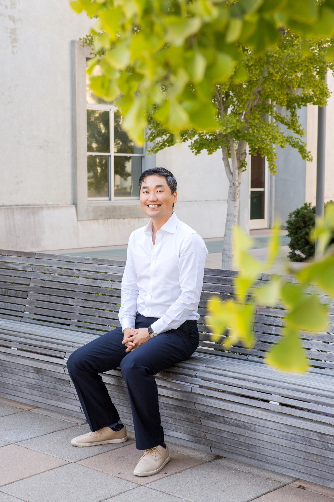

```{=html}
<div class="landing-hero" role="img" aria-label="Jae Yeon Kim presenting at the civic tech preconference"></div>

<div class="landing-sidebar">
  
  <h2>Jae Yeon Kim</h2>
  <p class="landing-title">Assistant Professor of Public Policy<br>University of North Carolina at Chapel Hill</p>
  <p class="landing-links">
    <i class="bi bi-envelope"></i> <a href="mailto:jaekim@unc.edu">Email</a>
    <span aria-hidden="true">·</span>
    <i class="bi bi-file-earmark-text"></i> <a href="https://jaeyk.github.io/CV_Jae_Yeon_Kim.pdf">CV</a>
    <span aria-hidden="true">·</span>
    <i class="bi bi-google"></i> <a href="https://scholar.google.com/citations?user=v2h903EAAAAJ&amp;hl=en">Scholar</a>
  </p>
  <p class="landing-tagline"><strong>My research aims to make policy implementation work.</strong></p>

  <section class="upcoming-talks" aria-labelledby="upcoming-talks-heading">
    <h3 id="upcoming-talks-heading">Upcoming Talks &amp; Events</h3>
    <ol id="landing-talk-list"></ol>
    <p class="talks-link"><a href="talks/talks.html">Full talks calendar</a></p>
  </section>

  <section class="new-publications" aria-labelledby="new-publications-heading">
    <h3 id="new-publications-heading">New Publications &amp; Media</h3>
    <ol id="landing-publication-list"></ol>
    <p class="publications-link"><a href="publications/pubs.html">All publications</a></p>
  </section>
</div>
<script src="talks/upcoming-talks.js"></script>
<script src="publications/recent-publications.js"></script>
```

<p class="hello">Hello! I am Jae.</p>

I am an Assistant Professor of Public Policy at [the University of North Carolina at Chapel Hill](https://publicpolicy.unc.edu/person/jae-yeon-kim/), and a non-resident Research Fellow at the Harvard Kennedy School and a [Better Government Lab](https://www.bettergovernmentlab.org/) Fellow at the University of Michigan's Ford School of Public Policy. I co-founded the [Data for Good Roundtables](https://sites.google.com/view/d4g-roundtables?usp=sharing) and serve on the Advisory Council of [the Summer Institute in Computational Social Science](https://sicss.io/people), the Procurement Committee at [the GovAI Coalition](https://www.sanjoseca.gov/your-government/departments-offices/information-technology/ai-reviews-algorithm-register/govai-coalition), and the APSA Task Force on Artificial Intelligence. In Spring 2027, I will be on research leave and visiting UC Berkeley's [Berkeley Economy & Society Initiative](https://besi.berkeley.edu/).

Previously, I worked as a Senior Data Scientist at Code for America, where I collaborated with the U.S. government to improve access to safety net programs. I also served as an Assistant Research Scientist at the SNF Agora Institute at Johns Hopkins University, where I co-developed [the Mapping the Modern Agora Project.](https://snfagora.jhu.edu/our-work/research-projects/mapping-the-modern-agora/) I earned my Ph.D. in Political Science from the University of California, Berkeley.

My research focuses on making policy implementation work. I study administrative burden in safety net programs, the relationship between civic infrastructure and democratic governance, and how state and local governments use artificial intelligence to deliver public services. Across these research programs, the common thread is an [American political economy (APE)](https://www.americanpoliticaleconomy.org/) framework that treats policy as a central site of political contestation.

I'm currently working on a book project titled [*Unseen and Uncounted*](https://jaeyk.github.io/book_projects/books.html), which examines how interactions between street-level bureaucrats and non-Black minority community organizers during the War on Poverty gave rise to new racial group formations-what we know today as Asian Americans and Latinos.

I use a wide range of methods, including big data and AI, field experiments, archival research, and human-centered design. I often collaborate with government and nonprofit partners to produce research that directly informs policy and improves practice.

My research has been published or is forthcoming in *Nature Human Behaviour*, *Journal of Policy Analysis and Management*, *Nature: Scientific Data* [2x], *Perspectives on Politics* [2x], *Political Research Quarterly* [2x], *Journal of Experimental Political Science*, *Studies in American Political Development*, and Cambridge University Press, among others.

I am the recipient of the Paul Volcker Junior Scholar Research Grant Award in Public Administration (2025), Emerging Scholar Award in Civic Engagement (2024), and the Best Dissertation Award in Urban and Local Politics (2022) from the American Political Science Association, as well as the Don T. Nakanishi Award for Distinguished Scholarship and Service in Asian Pacific American Politics (2020) from the Western Political Science Association.

::: {.callout-note .student-note}
## 🎓 For Prospective PhD and UNC Students

**PhD Students**: I won’t be taking students in the coming cycle (starting in Fall 2027). <!--If you are interested in working with me, please email me (1) which of my work you have read, (2) why it is connected to your research agenda, and (3) how I can help you develop it.-->

**UNC graduate and undergraduate students**: I cannot serve on your committee or advise on your honors thesis unless I know you well and there is a strong alignment between your topic and my research expertise. That said, if you think you could benefit from my expertise, please reach out to me by email and schedule a time during my office hours.
:::

<div style="clear: both;"></div>

::: {.calendar-source style="display: none;" aria-hidden="true"}
| Year | Date | Type | Event | Place |
|------|------|------|-------|-------|
| 2026 | September 16-18 | [Participant]{.badge .badge-participant} | Better Government Lab Research Retreat, Michigan Ford School of Public Policy (*scheduled*) | Ann Arbor, MI, USA |
| 2026 | September 3-6 | [Panel]{.badge .badge-panel} | [American Political Science Association (APSA) Annual Meeting](https://connect.apsanet.org/apsa2026/) (*scheduled*) | Boston, MA, USA |
| 2026 | June 16–18 | [Participant]{.badge .badge-participant} | [2026 Veritas Scholars Summit](https://summit.veritas.org/scholars-summit) (*scheduled*) | Park City, UT, USA |
| 2026 | June 11 | [Panel]{.badge .badge-panel} | Source Code AI Trust & Fairness Launch Event, [Federation of American Scientists](https://fas.org/) (*scheduled*) | Washington, DC, USA |
| 2026 | May 21 | [Talk]{.badge .badge-talk} | [AI and Social Sciences](https://politics.korea.ac.kr/kupolitics_kor/community/grad_school.do?mode=view&articleNo=804673&article.offset=0&articleLimit=10&totalNoticeYn=N&totalBoardNo&fbclid=IwY2xjawRPEeRleHRuA2FlbQIxMABicmlkETFwd0pSVVhHN2xaTTd2ZEY4c3J0YwZhcHBfaWQQMjIyMDM5MTc4ODIwMDg5MgABHsSLrFD-TJ9pjZXdolPqX79MkzjxQEvOtKUN_ddPlxued1JrXzLuFAgbdgAj_aem_fhq3jLsOEWuShEhMULwhMA), Department of Political Science and International Relations, Korea University, hosted by Woo Chang Kang (*scheduled*) | Virtual |
| 2026 | May 1 | [Talk]{.badge .badge-talk} | [The Future of Quantitative Social Science in an Age of Artificial Intelligenc](https://rohanalexander.com/tdw.html?fbclid=IwY2xjawRPEctleHRuA2FlbQIxMABicmlkETFwd0pSVVhHN2xaTTd2ZEY4c3J0YwZhcHBfaWQQMjIyMDM5MTc4ODIwMDg5MgABHrpKC20cB6deQ9gpFVoU0pkbwykSlhKol_1prTn6yWqn5Uj4YFUF6inmY9d3_aem_gfy7-jwggUYKf-t_TLT_Vw), University of Toronto, hosted by Rohan Alexander (*scheduled*) | Toronto, ON, Canada |
| 2026 | April 10 | [Talk]{.badge .badge-talk} | MPP Social, UNC Chapel Hill, hosted by Douglas MacKay | Chapel Hill, NC, USA |
| 2026 | March 25 | [Talk]{.badge .badge-talk} | Institute for AI and Social Innovation, Yonsei University, hosted by Wha Sun Jho | Virtual |
| 2026 | March 17 | [Discussant]{.badge .badge-discussant} | Economic Democracy Initiative Workshop, Columbia University, hosted by Alexander Hertel-Fernandez and Sophie Jacobson | Virtual |
| 2026 | March 9 | [Talk]{.badge .badge-talk} | [Data-Driven EnviroLab](https://datadrivenlab.org/), UNC Chapel Hill, hosted by Angel Hsu | Chapel Hill, NC, USA |
| 2026 | March 4 | [Participant]{.badge .badge-participant} | Source Code AI Trust & Fairness Co-Creation Forum, [Federation of American Scientists](https://fas.org/) | Washington, DC, USA |
| 2026 | February 14 | [Talk]{.badge .badge-talk} | [Conference on Society-Centered AI](https://sites.duke.edu/scai/), Duke University | Durham, NC, USA |
| 2025 | November 19 | [Talk]{.badge .badge-talk} | Institute of Governmental Studies, Korea University, hosted by Jun Koo | Virtual |
| 2025 | November 18 | [Panel]{.badge .badge-panel} | Virtual Job Market Event, hosted by Dept. of Political Science & IR, University of Southern California | Virtual |
| 2025 | November 12-16 | [Panel]{.badge .badge-panel} | [Association for Public Policy Analysis and Management](https://convention2.allacademic.com/one/appam/appam25/index.php?PHPSESSID=e5dt3n10fmreghdqs05jjdnik2&cmd=Online+Program+Search&program_focus=fulltext_search&search_mode=content&offset=0&search_text=jae+yeon+kim) (APPAM) | Seattle, WA, USA |
| 2025 | November 5-7 | [Participant]{.badge .badge-participant} | [The Gov AI Coalition Summit](https://events.govtech.com/GovAI-Coalition-Summit), hosted by GovAI Coalition and the City of San José | San José Convention Center, CA, USA |
| 2025 | October 30 | [Talk]{.badge .badge-talk} | New York City Mayor's Office of Economic Opportunity (NYC Opportunity), hosted by Sophia Tareen | Virtual |
| 2025 | October 30 | [Panel]{.badge .badge-panel} | Virtual Job Market Event, hosted by Dept. of Political Science, UC Berkeley, feat. Natalia Garbiras-Díaz | Virtual |
| 2025 | October 22 | [Talk]{.badge .badge-talk} | [PRIISM Seminar Series](https://steinhardt.nyu.edu/priism/events/upcoming-events), NYU, hosted by Klint Kanopka and Ravi Shroff | Virtual |
| 2025 | October 16-17 | [Participant]{.badge .badge-participant} | Better Government Lab Research Retreat, Georgetown McCourt School of Public Policy | Washington, DC, USA |
| 2025 | October 15 | [Talk]{.badge .badge-talk} | [Tech and Innovation Speaker Series](https://www.eventbrite.com/e/move-fast-without-breaking-things-how-smarter-ai-procurement-can-transform-tickets-1735067777429?aff=oddtdtcreator&fbclid=IwY2xjawNNAfdleHRuA2FlbQIxMQABHnsxf4GYAeRsWTlxWK-H9CRIqIByrPn9tESrSAf8cxK4URtCHR5cuYKYvC-5_aem_SHj7mHP6-Rd1QymDv3xcVA), Johns Hopkins SAIS | Washington, DC, USA |
| 2025 | Sep 30 | [Talk]{.badge .badge-talk} | Inequality Working Group Seminar, [EAAMO (Equity and Access in Algorithms, Mechanisms, and Optimization)](https://bridges.eaamo.org/working_groups/inequality/) | Virtual |
| 2025 | Sep 11–14 | [Panel]{.badge .badge-panel} | [American Political Science Association](https://convention2.allacademic.com/one/apsa/apsa25/index.php?PHPSESSID=q29h0kdgp0ikoco6u9j6vdt6t9&cmd=Online+Program+Search&program_focus=fulltext_search&search_mode=content&offset=0&search_text=jae+yeon+kim) (APSA) | Vancouver, Canada |
| 2025 | Sep 10 | [Discussant]{.badge .badge-moderator} | [Narrative and Text Analysis in the Study of Migration and Citizenship](https://migration.ubc.ca/events/event/apsa-pre-conference/) hosted by the UBC's Centre for Migration Studies | Vancouver, Canada |
| 2025 | August 14-16 | [Participant]{.badge .badge-participant} | New Faculty Orientation, hosted by UNC-CH | Chapel Hill, NC, USA |
| 2025 | July 29 | [Panel]{.badge .badge-panel} | [Annual Research Conference on the American Political Economy](https://www.americanpoliticaleconomy.org/events/annual-conference) | Virtual |
| 2025 | June 27–28 | [Talk]{.badge .badge-talk} | Korea Foundation for Advanced Studies | Seoul, South Korea |
| 2025 | June 26 | [Panel]{.badge .badge-panel} | Dept. of Political Science & IR, Seoul National University, hosted by Seo-young Silvia Kim | Seoul, South Korea |
| 2025 | June 26 | [Panel]{.badge .badge-panel} | Public Management Research Conference (PMRC) | Seoul, South Korea |
| 2025 | June 25 | [Panel]{.badge .badge-panel} | Korea-Finland Innovation Forum, hosted by Yonsei University and the Embassy of Finland, Seoul | Seoul, South Korea |
| 2025 | June 19 | [Talk]{.badge .badge-talk} | KIXLAB, KAIST, hosted by Juho Kim | Daejeon, South Korea |
| 2025 | June 17 | [Talk]{.badge .badge-talk} | *Entangled with Books* (independent bookstore) | Seoul, South Korea |
| 2025 | June 13 | [Talk]{.badge .badge-talk} | Dept. of Political Science & IR, Yonsei University, hosted by Inbok Rhee | Seoul, South Korea |
| 2025 | June 10 | [Talk]{.badge .badge-talk} | Graduate School of International Studies, Korea University, hosted by Sunkyoung Park | Seoul, South Korea |
| 2025 | May 29–30 | [Panel]{.badge .badge-panel} | [Code for America Summit](https://summit.codeforamerica.org/agenda/) | Washington, DC, USA |
| 2025 | May 28 | [Participant]{.badge .badge-participant} | What's next for CX in Government?, hosted by Georgetown University's Better Government Lab | Washington, DC, USA |
| 2025 | May 23 | [Participant]{.badge .badge-participant} | [Conference on Experimentation](https://datascience.stanford.edu/events/causal-science-center/stanford-causal-science-center-conference-experimentation), hosted by Stanford Causal Science Center | Palo Alto, CA, USA |
| 2025 | Feb 26 | [Talk]{.badge .badge-talk} | [American Politics Workshop](https://planitpurple.northwestern.edu/event/625048), Northwestern University | Evanston, IL, USA |

:::
