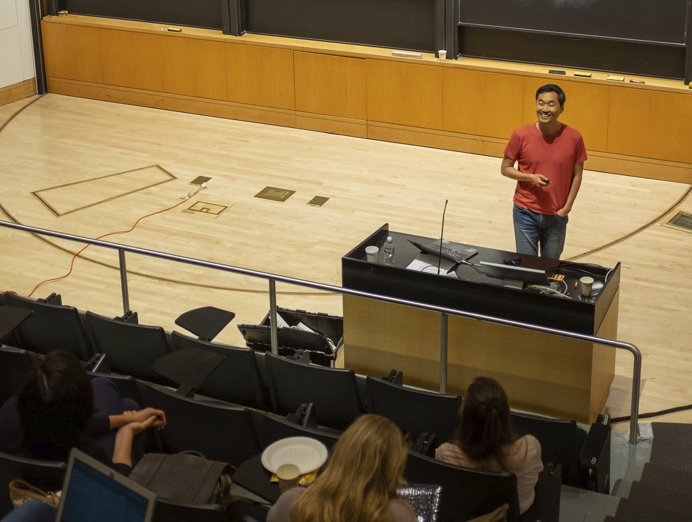

> "Human nature is not a machine to be built after a model, and set to do exactly the work prescribed for it, but a tree which requires to grow and develop itself on all sides, according to the tendency of the inward forces which make it a living thing."
>
> -- John Stuart Mill, *On Liberty* (1859), Chapter 3

I am committed to providing excellent and accessible learning experiences for students at both the undergraduate and graduate levels. In 2021, I earned a [Certificate in Teaching and Learning in Higher Education](https://gsi.berkeley.edu/programs-services/certificate-program/) from UC Berkeley. In 2017, I received the *Outstanding Graduate Student Instructor Award* for my instruction in undergraduate quantitative methods and research design. Given to fewer than ten percent of graduate student instructors, the award recognized the quality of my teaching even in my first semester in the classroom.

My pedagogical approach combines liberal arts–style broad intellectual foundations with design school–style hands-on experiences. My strength as an instructor comes from my interdisciplinary training and extensive applied experience. My objective is to help students build strong intellectual foundations while simultaneously developing the habits of mind that allow them to tackle new problems. Guided by these principles, my teaching in public policy and data science emphasizes engagement with big ideas and cutting-edge scholarship, alongside sustained attention to practical applications and ethical implications. *In so doing, I aim to help my students become scientists, designers, and engineers of organizations and institutions that serve the public interest.*

**Current Teaching in Public Policy (UNC-CH)**

* **The Politics of Public Policy** \[[course website](https://jaeyk.github.io/politics_of_public_policy/)\]

<iframe src="https://jaeyk.github.io/politics_of_public_policy/" width="100%" height="380" style="border:1px solid #e0e0e0; border-radius:6px; margin:0.5rem 0 1rem;"></iframe>

<strong>Potential Future Courses at the Intersection of Public Policy and Data Science (UNC-CH)</strong>

- **AI Policy and Power Architecture**  

This course introduces students to the framework of power architecture and its relationship to the design and implementation of AI policy through readings, discussions, and hands-on, project-based exercises. In policy, certain outcomes are achieved while others are not. Certain issues make it onto the policy agenda while others do not. Understanding these differences requires us to examine who has the power to make decisions and what institutional arrangements and organizational configurations structure these decision-making processes.

The course is divided into three stages: the setup (introducing the power architecture framework), the design (building policy prototypes), and the testing (stress-testing and learning). Students will form small groups, select their own AI use cases, and determine what kinds of risks they are willing to tolerate and to what extent. They will then examine what institutional arrangements and organizational vehicles are needed to achieve their goals and whether their proposed plans are feasible given the policy, implementation, and political contexts they will face.

This is a deeply intellectual course, but it also has a practical goal: helping policy students connect their interests to technical domains and data science students apply their technical knowledge to policy problems.

 

<strong> Courses Taught (UC Berkeley, KDI School, etc)</strong>

#### Graduate Seminars

##### KDI School of Public Policy and Management

- [**R Fundamentals for Public Policy**](https://github.com/KDIS-DSPPM/r-fundamentals) (Spring 2022, Fall 2022)
- [**Data Visualization and Communication**](https://github.com/KDIS-DSPPM/data-visualization) (Summer 2022)

##### UC Berkeley

- [**Introduction to Computational Tools for Social Science**](https://github.com/PS239T/spring_2021)  
  - Instructor of record: Spring 2019, Spring 2021  
  - Graduate Student Instructor (GSI): Fall 2016 (with Rachel Bernhard)

- [**Digital Data Collection Workshop**](https://github.com/jaeyk/digital_data_collection_workshop) (Fall 2020, with Nick Kuipers)

#### Undergraduate Lectures

- **Introduction to Empirical Analysis and Quantitative Methods** (UC Berkeley, Fall 2016)  
  - GSI for Laura Stoker  
  - *Outstanding Graduate Student Instructor Award*

<strong>Pre-conference Tutorials</strong>

- [**IC2S2 (2024): Training CSS PhDs for Academic & Non-Academic Careers**](https://ic2s2-2024.org/tutorials)
- [**SICSS-Howard (2021): R Bootcamp**](https://github.com/jaeyk/sicss-howard-r-boot-camp) – *Invited Instructor*

<strong>Workshops (Selected)</strong>

- **Doing Social Science with Generative AI: Research Design, Practical Tools, and Ethical Considerations**, Korea University (2025) – *Invited Instructor*
- **Summer Institute in Migration Research Methods**, UC Berkeley (2024) – *Invited Instructor*  
- [**Digital Data Collection**](https://github.com/jaeyk/summer_digital_data_collection), Korea University (2022) – *Invited Instructor*  
- [**UC Berkeley D-Lab**](https://github.com/dlab-berkeley) (2020–2021):  
  - Fairness and Bias in Machine Learning  
  - Machine Learning in R  
  - SQL for R Users  
  - Functional Programming in R  
  - R Package Development  
  - Advanced Data Wrangling  
  - Project Management in R  
  - R Fundamentals

<strong>Guest Lectures (Selected)</strong>

- **2025** – Johns Hopkins: [NLP for CSS](https://nlp-css-601-672.cs.jhu.edu/sp2025/index.html), Brown: Watson Institute's [GPD Module](https://home.watson.brown.edu/opportunity/pre-dissertation-fellowship), Korea University 
- **2024** – Johns Hopkins: Democracy by the Numbers  
- **2023** – Wesleyan: Democracy in East Asia  
- **2022** – National University of Singapore, KAIST, Korea University, Sungkyunkwan University  
- **2021** – KAIST, Dartmouth

<strong>Pedagogical Publications and Resources</strong>

- **Textbook:** [*Computational Thinking for Social Scientists*](https://jaeyk.github.io/comp_thinking_social_science/)  
An open-access textbook (CC BY‑NC‑SA 4.0) that equips social scientists with modern computational skills: reproducible workflows (Git, Bash, tidy data), functional programming in R, data product development, semi-structured data collection, computational text analysis, predictive modeling, and database management with SQL. Each modular chapter features live code, interactive exercises, and practical examples—all freely available for adaptation, classroom use, and self-learning.

- **Article:** [*Training CSS PhDs for Academic and Non-Academic Careers*](https://www.cambridge.org/core/journals/ps-political-science-and-politics/article/training-computational-social-science-phd-students-for-academic-and-nonacademic-careers/1455690939833B9FFCAC664D4E412057?utm_source=hootsuite&utm_medium=twitter&utm_campaign=PSC_Sep23), *PS: Political Science & Politics* (2024)  
  - *PDF views:* 2,005 | *HTML views:* 6,420 (as of September 18, 2025)  
  - Co-authored with Aniket Kesari (Fordham Law), Sono Shah (Pew), Taylor Brown (Meta), Tiago Ventura (Georgetown), Tina Law (UC Davis)
  - [IC2S2 2024 Slides](https://github.com/jaeyk/jaeyk.github.io/blob/main/slides/training_css_phd.pdf)  
  - [IC2S2 2024 Tutorial site](https://github.com/jaeyk/ic2s2-training-css-tutorial)
  
- **Article:** [*Teaching Computational Social Science for All*](https://www.cambridge.org/core/journals/ps-political-science-and-politics/article/teaching-computational-social-science-for-all/66EAB886BCF21C647E2387051D6A9BEF), *PS: Political Science & Politics* (2022)  
  - *PDF views:* 1,085 | *HTML views:* 1,369 (as of September 18, 2025)  
  - Co-authored with Margaret Ng (UIUC)

- **Article:** ["Five Principles to Get Undergraduates Involved in Real-world Data Science Projects."](https://ocean.sagepub.com/blog/skills/5-principles-to-get-undergraduates-involved-in-real-world-data-science-projects) *SAGE Ocean* (2020)

- **Op-ed:** ["Why Teaching Social Scientists How To Code Like A Professional Is Important."](https://dlab.berkeley.edu/news/why-teaching-social-scientists-how-code-professional-important), *UC Berkeley D-Lab* (2020)

{fig-align="center" width="60%"}
